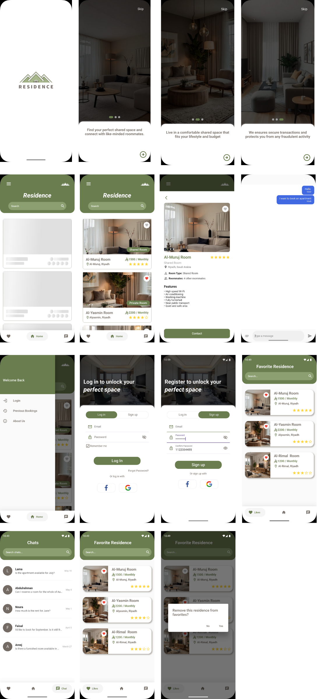

## Residence App 🏠
### Tuwaiq Academy Flutter Bootcamp

### 💡 Project Idea

Residence is a mobile app designed to offer affordable shared accommodation options in Riyadh. With the rising cost of living, we provide users with a platform to find and connect with others looking for shared housing, ensuring a budget-friendly living experience. The app allows direct communication between users and landlords, with financial security and guaranteed rights for all parties involved. Whether you're looking for a room or seeking housemates, Residence simplifies the process and ensures a smooth experience for both tenants and property owners.


---
### 🔍 Project Preview





---
### 📦 Packages Used

- **flutter_chat_ui**: Provides a ready-made chat UI for Flutter apps.
- **shimmer**: Adds a shimmering effect for displaying loading states.
- **smooth_page_indicator**: Provides a smooth page indicator for navigating between pages.
- **flutter_svg**: Renders SVG images in Flutter applications.
- **google_nav_bar**: Provides a Google-style bottom navigation bar for Flutter apps.

---

### 📱 Widgets Used

1. AlertDialog  
2. AppBar  
3. BottomNavigationBar  
4. BottomSheet  
5. Center  
6. CircleAvatar  
7. Column  
8. Container  
9. Drawer  
10. DrawerHeader  
11. Divider  
12. TextField  
13. Expanded  
14. Icon  
15. IconButton  
16. Image  
17. ListTile  
18. ListView  
19. Padding  
20. PageView  
21. Positioned  
22. Row  
23. SafeArea  
24. Scaffold  
25. SearchBar  
26. SingleChildScrollView  
27. SizedBox  
28. SmoothPageIndicator  
29. Stack  
30. TabBar  
31. TabBarView  
32. Text  


---
### ⚙️ Tech Stack
- **Flutter**
- **Dart**

---
### 💻  Setup instructions 

 1. Clone the repository:

```
https://github.com/RemasNg1/App-Design-Implementation\residence_app.git
```
2. Navigate to the project folder:

```
cd App-Design-Implementation\residence_app
```

3. Install dependencies:
```
flutter pub get
```

 4. Run the app:
 ```
 flutter run 
 ```  

---
### 📂 Folder Structure 

```
 ├── main.dart
   ├── widgets
   │   ├── booking_card_shimmer_widget.dart
   │   ├── booking_card_widget.dart
   │   ├── bottom_sheet.dart
   │   ├── chat_tile_widget.dart
   |   ├── favorite_card_shimmer_widget.dart
   │   ├── favorite_card_widget.dart
   │   ├── room_card_shimmer_widget.dart
   │   └── room_card_widget.dart
   └── screens
       ├── favorit_screen.dart
       ├── home_screen.dart
       ├── login_signup_screen.dart
       ├── previous_bookings_screen.dart
       ├── splash_screen.dart
       ├── chats_screen.dart
       ├── chat_view.dart
       ├── bottom_navbar.dart
       └── started_screen.dart
       
       
```


---
### 🖊️ Author
Remas Alnugaithan


