# ⚫Coursa App 

A beautiful Flutter app for learn courses

---

## Screenshots

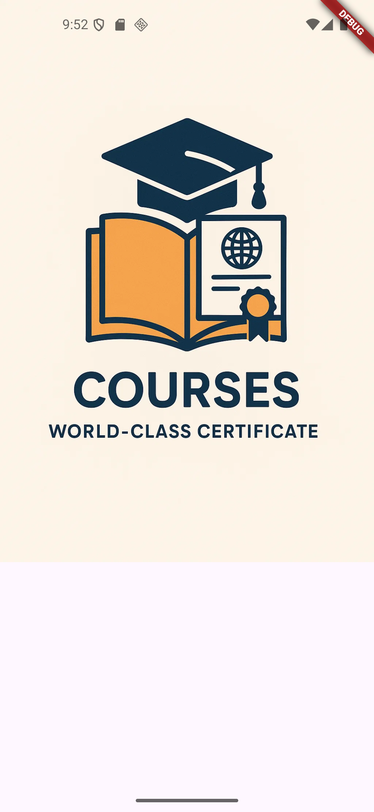


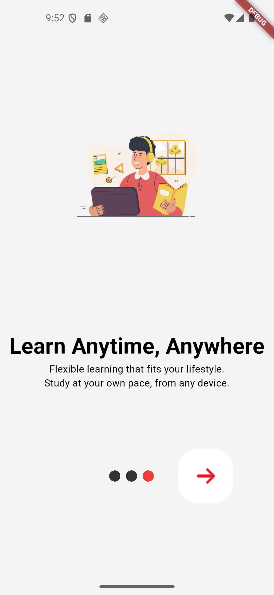
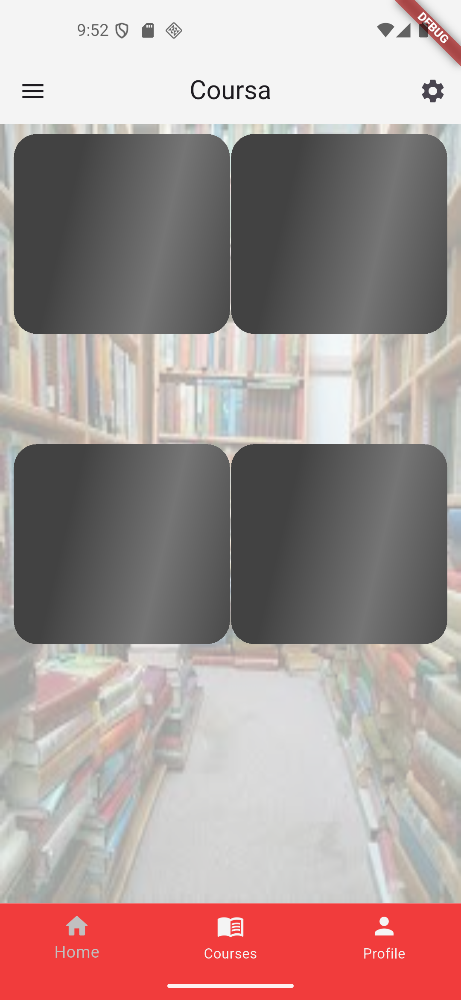
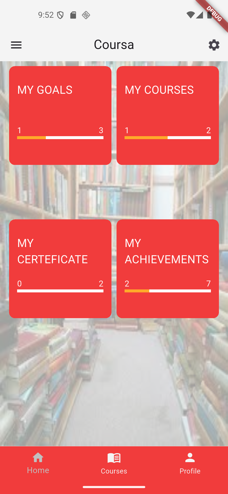
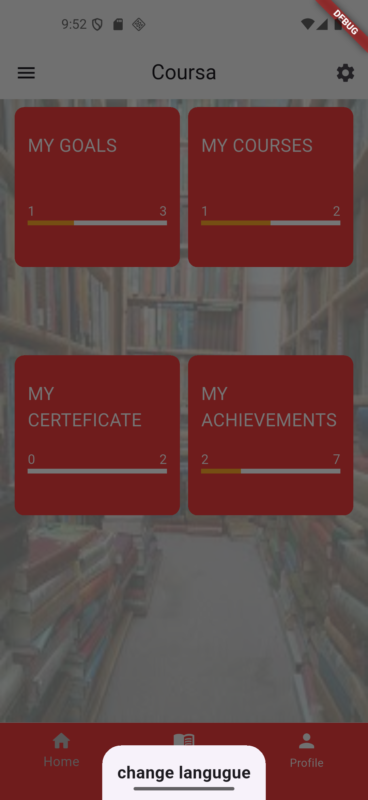
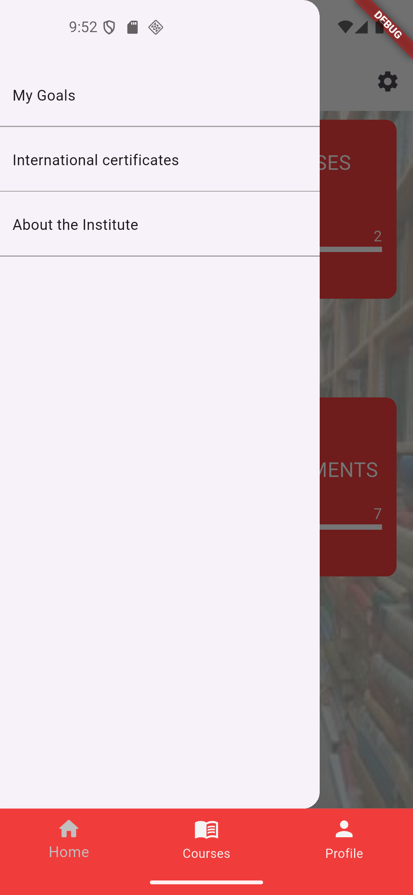
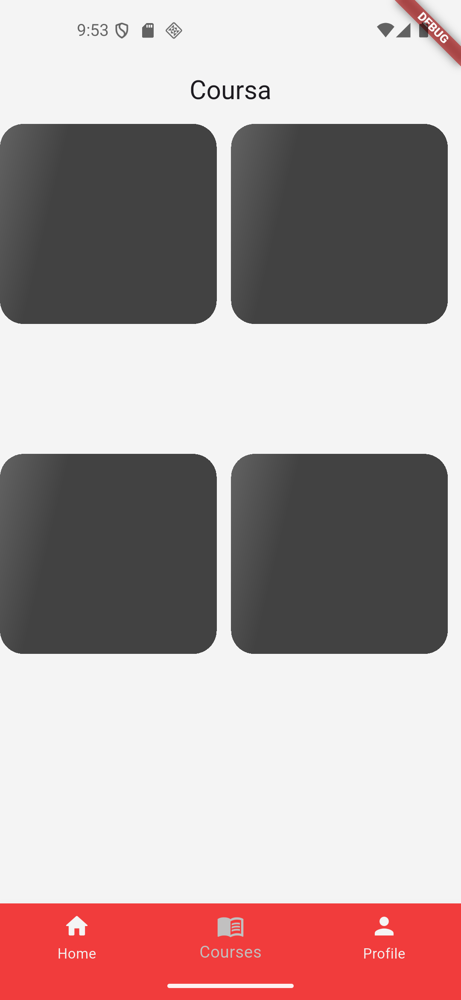
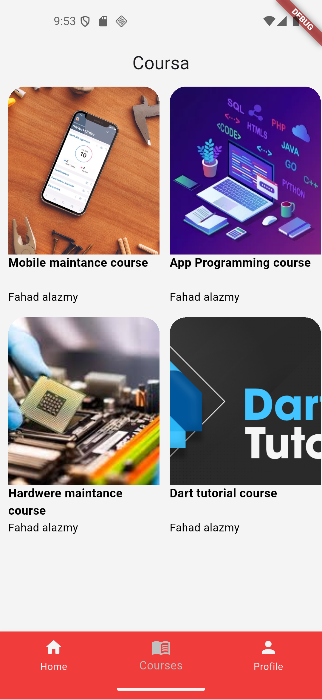
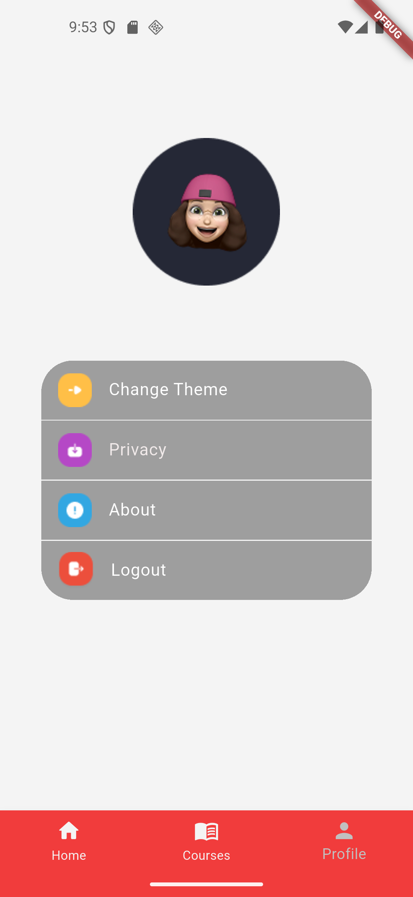
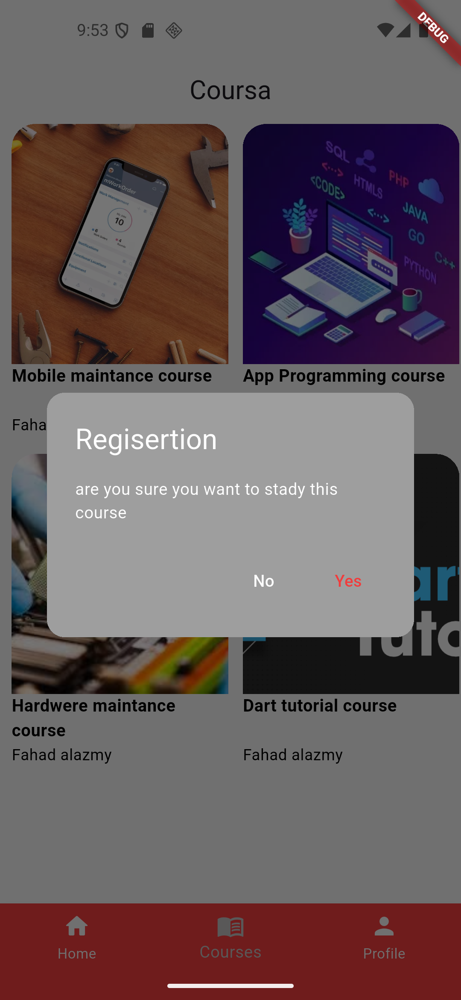
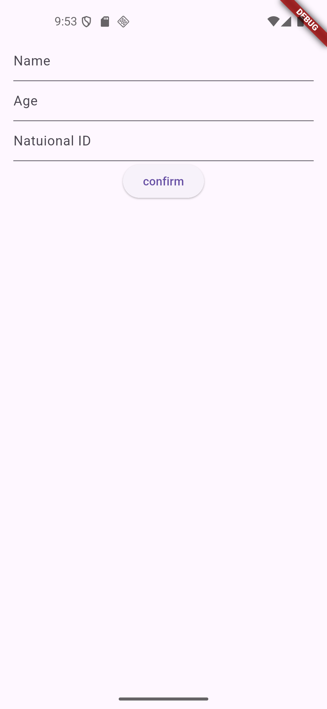


---


## Tech Stack

- Flutter
- Dart

---

## Installation

1. Clone the repository:

```bash
git clone https://github.com/Ahmed-Almansour99/App-Design-Implementation.git

cd Podkes-App

cd podkes_app

flutter pub get

flutter run
```


## Author

github : Ahmed-Almansour99
 

