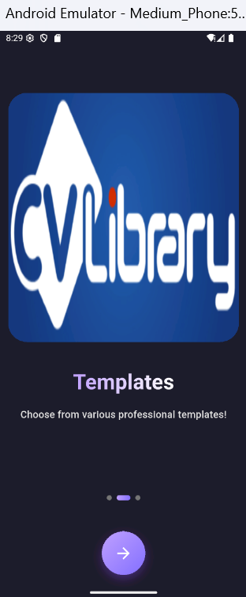

# 📝 CV Template App

# Project Description
A Flutter-based mobile application designed to help users create professional-looking CVs (Curriculum Vitae) quickly and easily. The app provides a variety of customizable templates catering to different professions and styles, including basic, professional, creative, and modern designs. Users can navigate through the app using a bottom navigation bar, accessing sections like Home, Templates, and Profile. The Home screen displays trending templates with visually appealing loading indicators, while the Template screen allows users to browse and purchase additional templates. The Profile screen enables users to manage their personal information and settings. With a focus on user-friendly design and seamless navigation, the CV Template App simplifies the CV creation process for job seekers and professionals.

# ⚙️ Setup Instructions
Clone the repository: Use the command line: git clone <Your Repository Path>

Install dependencies: Make sure you have Flutter installed. Then run: flutter pub get

Run the app: You can launch the app using: flutter run

Note: You need a working emulator or a connected real device

# 🎯Design Objectives

✅ Deliver a visually appealing, clutter-free UI

✅ Ensure consistent spacing, font sizing, and component alignment

✅ Prioritize fast and fluid navigation

✅ Optimize for both usability and visual engagement

✅ Design scalable components for future feature additions

 # 📱Screen Design Overview
 
## Splash Screen

## Started Screen 

### Welcome Onboarding 1

### Templates Onboarding 2

### Get Started Onboarding 3

## Login Screen

## Signup Screen

## Home & Main Navigation Screen

## Drawer Main Items

## Detail Screen

## Purchase Bottom Sheet

## Template Screen

## Profile Screen

   

## Logout  Alert

