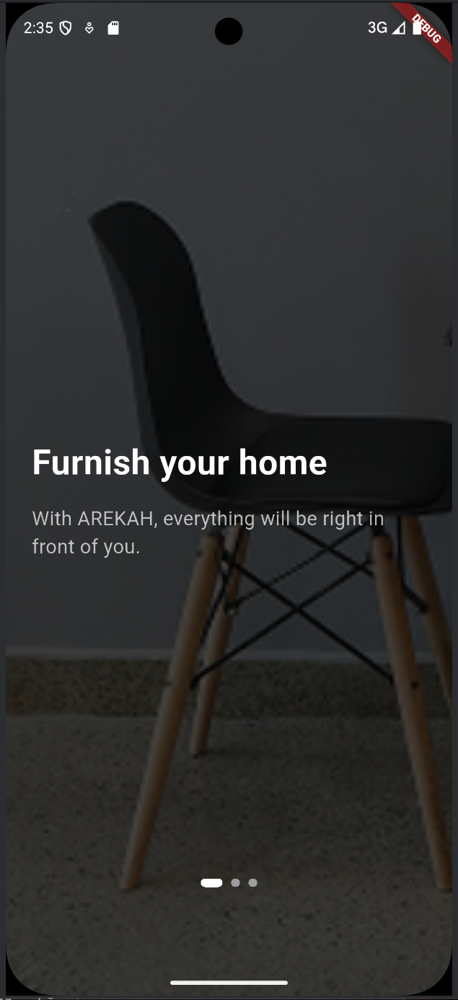
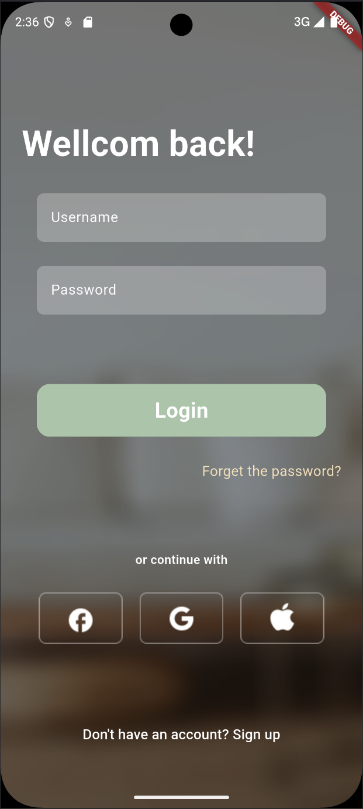
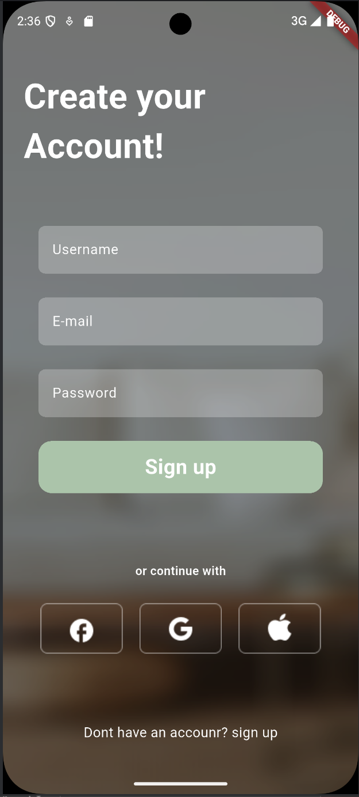
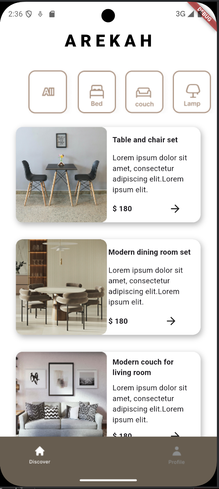
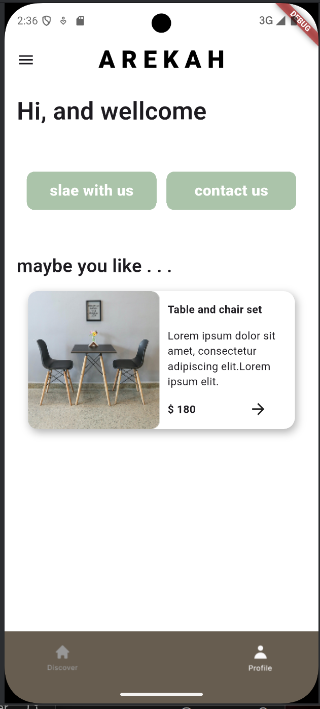

# 🪑 AREKAH – Flutter Furniture App

## Overview

**AREKAH** is a modern furniture shopping app built with Flutter.  
It offers an intuitive and visually appealing user interface for browsing, exploring, and selecting furniture items. The project showcases advanced UI design and Flutter development practices.

---

##  Key Features

-  Splash screen with brand logo  
-  Shimmer effect while loading content  
-  Bottom navigation bar for major app sections  
-  TabBar and PageView for categorized navigation  
-  Drawer for additional options and profile access  
-  AlertDialogs for confirmations and prompts  
-  TextFields for login, search, and form input  
-  Bottom sheet for item details and actions  
-  External SVG asset usage for icons and illustrations  

---

##  Widgets and Packages Used

| Feature | Description |
|--------|-------------|
| 🔹 `Drawer` | Navigation panel for accessing other pages |
| 🔹 `AlertDialog` | Used for displaying confirmation dialogs |
| 🔹 `TextField` | For search bars, login forms, and user input |
| 🔹 `BottomNavigationBar` | Navigation between home, explore, and profile |
| 🔹 `flutter_svg` | Rendering SVG icons and illustrations |
| 🔹 `shimmer` | Smooth loading placeholder for images/content |
| 🔹 `TabBar` & `TabBarView` | Organized tabbed views for categories |
| 🔹 `PageView` | Used for onboarding and slider pages |
| 🔹 `BottomSheet` | Displaying additional item info or actions |
| 🔹 `ListView`, `Column`, `Stack`, `Container` | Core layout structure |

---

##  External Packages

- [`flutter_svg`](https://pub.dev/packages/flutter_svg) – SVG image rendering  
- [`shimmer`](https://pub.dev/packages/shimmer) – Shimmer loading effect

---

##  Design Reference

All UI designs were created and prototyped using **Figma**.  
 [Figma Design File – AREKAH](#) *(https://www.figma.com/design/deEiPpPsknQsuEcA0ThlD4/Untitled?node-id=1-1769&t=qeegq29pv92T3kuO-0)*

---

##  Screenshots & Demo

 App Screenshots:  
*(Insert images using Markdown)*  
```markdown

[](2.png)[](3.png)






```

 Demo Video:  
[](AREKAH.mp4)

---

##  How to Run the Project

1. Clone the repository:
   ```bash
   git clone https://github.com/your-username/arekah.git
   ```
2. Navigate to the project folder:
   ```bash
   cd arekah
   ```
3. Get Flutter dependencies:
   ```bash
   flutter pub get
   ```
4. Launch the app:
   ```bash
   flutter run
   ```

---

 

---

