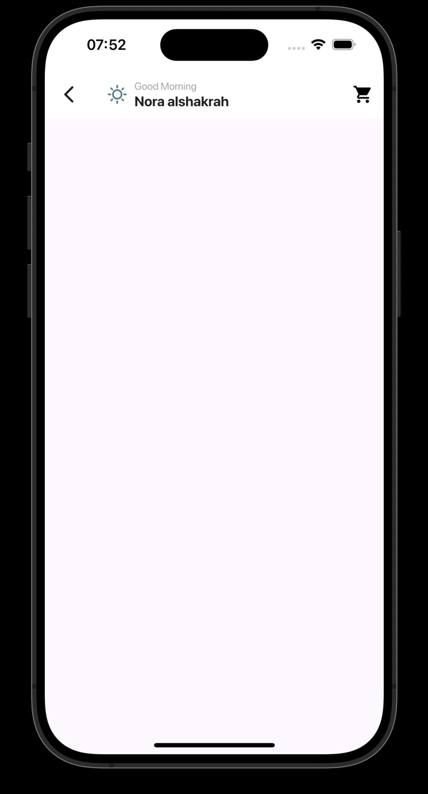
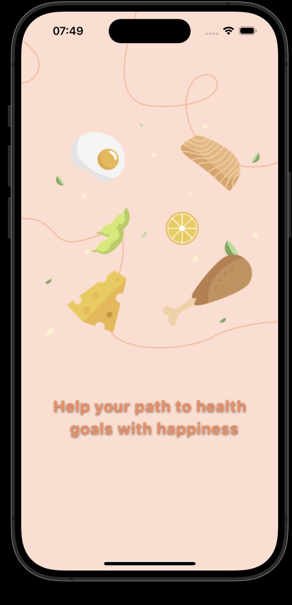
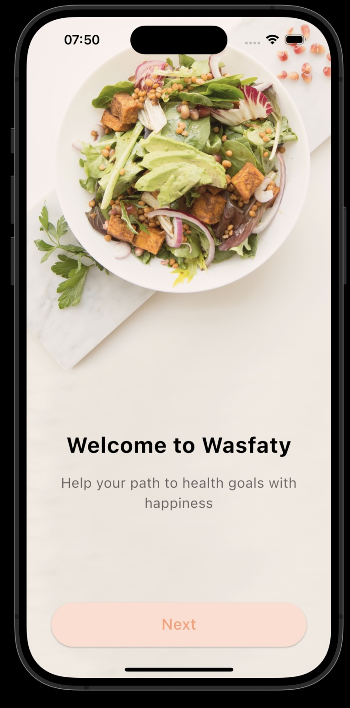
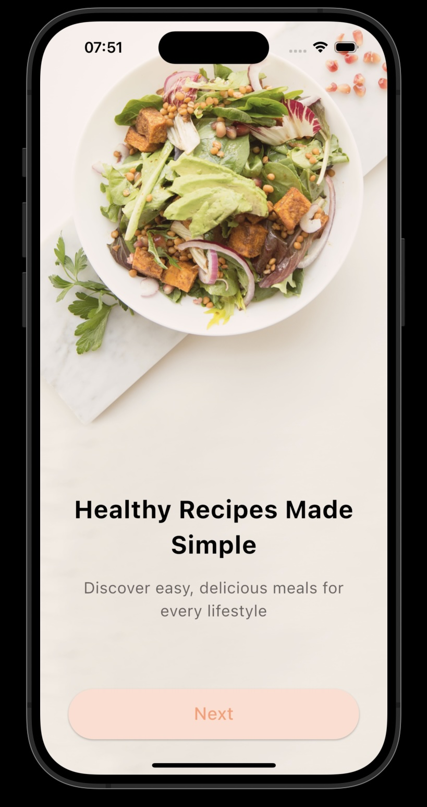
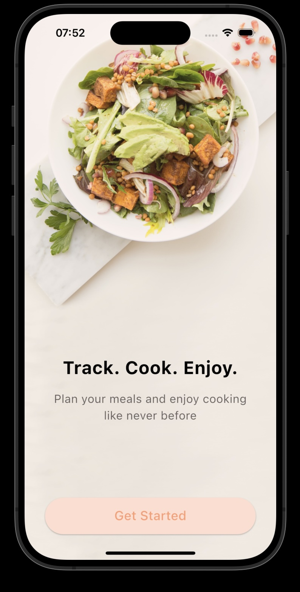

# 🍽️ My Recipes App

A beautiful Flutter app for browsing, saving, and organizing recipes in a clean and user-friendly way.

---

## 📸 Screenshots

  
Example:  

---

## ✨ Features

- Browse delicious food recipes.
- Add and remove favorite recipes.
- View detailed recipe instructions and ingredients.
- Responsive and modern UI design.
- Onboarding experience for new users.
- Bottom navigation for smooth app navigation.

---

## 🛠️ Tech Stack

- Flutter (latest stable version)
- Dart
- `google_fonts`, `shimmer`, `flutter_svg` (UI enhancements)

---

## 🚀 Installation

1. **Clone the repository**:
 
   git clone https://github.com/Norah200/App-Design-Implementation.git
Install the dependencies:
flutter pub get
Run the app:
flutter run

Folder Structure
lib/
├── screens/      
├── widgets/         
├── data/           
└── main.dart       

Launch the app.

Swipe through onboarding pages (if first time).

Browse available recipes by category.

Tap any recipe to view full details.

Add recipes to your favorites.

Enjoy cooking!

## 👤 Author

- **Norah Alshakarh**  
- [GitHub: @Norah200](https://github.com/Norah200)

