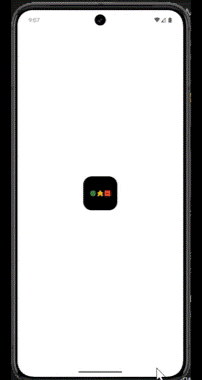

#   🧩 Meeple — Board Game Marketplace 
               
  

- Designed for board game lovers, Meeple offers a curated collection of group games that bring people together, all in one easy-to-use shopping platform.

#  🏗️Tech Stack
- 👾 Frontend: Flutter, Dart
- 🎨 Design: Figma

# ⬇️Installation
1. ⿻ Clone the repository:
git clone 

2. ➤ Navigate to the project folder:

3. ⬇ Install dependencies:
flutter pub get

4. ⚡︎ Run the app:
flutter run

# 🎨 Figma Design
 - [Meeple App Figma](https://www.figma.com/design/ldc33ysfM3kJErTUbO9dyb/Meeple-App?node-id=0-1&t=sE0vanjnqwQVfTsu-1)

 # 📦 External packages
 - Shimmer – Used to create a skeleton loading effect while data is being fetched.
 - SmoothPageIndicator – For adding smooth and animated page indicators in onboarding screens.

# 💡How to Use
1. ✍🏽 Login / Sign Up:

      Start by creating a new account or logging in using your email and password.

2. 👀 Browse Games:

      Explore a variety of group board games tailored to different interests and ages.
   
   
3. ➕ Add to Wishlist:

      Like a game? Save it to your wishlist for quick access later.

4.  🛒 Add to Cart:

       When ready to purchase, add games to your shopping cart with a single tap.

5.  💸 Checkout & Purchase:

        Proceed to checkout, select your payment method, and confirm your order.

6.  👤 View Profile:

        Track your orders, manage your wishlist and cart, and update your personal information from the profile section.

#  👨🏻‍🎨Author
- Lojain Maged

