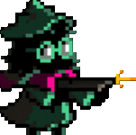

#  StreamBun 🐇🥪

We all were in a situation where we are hungry and order food that's the easy part but the hard part about it is what am I going to watch 😮‍💨

Well worry not my friend Because I'm here
 <br>
I offer you StreamBun 🐇 You can watch quickly your favorite streamer
or even watch a new streamer and maybe they will be your new favorite, you can discover the games and watch their walkthrough 🎮🎮

---


---

## 📱 Features


- 🏃‍♂️‍➡️🏃‍♀️‍➡️ **Follow A streamer** – You can Follow your favorite streamer easily (not following them in real life).
- ♥️ **Like Streams** – You can like any stream you want and support your favorite streamer ⭐.
- 🔎 **Search** – You can search for your favorite game or favorite game easliy before finishing your food 🍔👀.
- ⭐ **Trending** – You can check trending streamers or games through StreamBun and Discover new world of games 🎮🌍.
- 🖼️ **Profile screen** – Each user now can achive their dream which is putting their pet cat as a porfile picture 🐱.
- 📨 **Chat** – instead using email or carrier pigeon 🕊️, now you can easily chat with your favorite streamer live !!!!. 
- 📱 **Splash Screen** – A masterpiece beautiful splash screen that you want to watch while eating.
- ⚙️ **Setting page** – Setting page to customize your experience.

- 🗄️ **A Drawer** – For quick access before finishing your food.

---

## 📦 Packages

 [Font Awesome Icon](https://pub.dev/packages/font_awesome_flutter)
 [Animated Text Kit](https://pub.dev/packages/animated_text_kit)
 [Shimmer](https://pub.dev/packages/shimmer)


---

---

## 💻 Tech

- **Flutter** 
- **Dart**
 

---
## 💻 installation

1-All you have to do is to install dart and flutter from [HERE](https://dart.dev/get-dart).

2- download [Android Studio](https://developer.android.com/studio?hl=ar) to play the emulator or you can use any emulator you like.

3-  Clone the repo from me
```
git clone https://github.com/AymanAlzahrani/Podkes-App.git
 ```


4- go to the cloned repo on your preffered location
```
 cd desktop/Podkes-App/assignment8
```
5- now enter this line to open VSCode like magic 🪄🪄
```
code .
```

6- run this code to run the program and get ready to fight your hunger

```
flutter run
```

7- make a cup of tea because you made it (or coffee) ☕🍵  


---

## ✨ Written by Ayman Alzahrani

plaese if you have any suggestions contact me <a href="mailto:aymangormallah@gmail.com">Here.</a>

On this project I went through a lot of streaming platforms and thorugh A LOT of games my gamer sense came back after a long time (it didn't go anywhere because I just don't have time)


 


if you don't get it about the name StreamBun it's from bun like bunny and bun from like the bread and bun from a joke (Pun)
all togehter the bunny bun pun  !!!!

 
